# To-Do App

## Customizable Kanban board like Task Manager

## Demo

[-blue.svg>)](https://to-do-app-gold.vercel.app/)


## Features

- Drag-n-Drop cards and list
- Material UI
- Delete and Add Cards and Lists
- Update/Edit List and Cards

## 🛠 Technologies Used

- React Js - `Javascript library to create UI`
- react-beautiful-dnd - `npm Package`
- Node Js - `JavaScript runtime built`
- Visual Studio Code - `Code Editor`

## Installation

This project was bootstrapped with [Create React App](https://github.com/facebook/create-react-app).

## Available Scripts

In the project directory, you can run:

### `yarn start`

Runs the app in the development mode.\
Open [http://localhost:3000](http://localhost:3000) to view it in the browser.

The page will reload if you make edits.\
You will also see any lint errors in the console.

### `yarn test`

Launches the test runner in the interactive watch mode.\
See the section about [running tests](https://facebook.github.io/create-react-app/docs/running-tests) for more information.

### `yarn build`

Builds the app for production to the `build` folder.\
It correctly bundles React in production mode and optimizes the build for the best performance.

The build is minified and the filenames include the hashes.\
Your app is ready to be deployed!

See the section about [deployment](https://facebook.github.io/create-react-app/docs/deployment) for more information.

### `yarn eject`

**Note: this is a one-way operation. Once you `eject`, you can’t go back!**

## DOCKER IMAGE - KUBERNET - KUBECTL

### DOCKER IMAGE (SOLO PRUEBA)

1. Crear archivo [Dockerfile](./Dockerfile). **NOTA**: Esto es Obligatorio.
2. Ejecutar

```
    docker build -t jmlqtest/to-do .
```

#### **SOLO POR VALIDACION**

1. Crear Contenedor

```
    docker container run -dp 85:80 --name to-do-gitactions jmlqtest/to-do
```

2. Subir a Docker Hub (Solo Validacion)

```
    docker push jmlqtest/to-dos
```

3. Crear un tag en imagen Docker Hub

```
    docker image tag jmlqtest/to-do:latest jmlqtest/to-do:1.0.0
    docker push jmlqtest/to-do:1.0.0
```

4. Descargar Imagen Docker Hub

```
    docker pull jmlqtest/to-do
```

5. **KUBERNET - KUBECTL**

- Ejecutar Kubernete

```
        kubectl apply -f todo-app.yml
        kubectl get pods --watch
        minikube service todo-app-service
```

- Eliminar

```
        kubectl get deployments
        kubectl delete deployment todo-app-deployment
        kubectl get services
        kubectl delete service todo-app-service
```

## PUBLICAR EN AWS

### **Configurar AWS CLI**

1.  Descargar e Instalar [AWS CLI](https://docs.aws.amazon.com/es_es/cli/latest/userguide/getting-started-install.html)

2.  Validar Version

```
        aws --version
```

3.  Confogurar Login AWS

```
        aws configure
```

### CONFIGURAR ECR

#### **CREAR POLITICA PARA USO DE ECR**

Esta [política](./assets/politica-ecr.json) se debe asignar al usuaio con el que se va a acceder desde AWS CLI

### **CONFIGURAR CREDENCIALES AWS**

1. Ejecutar

```
        aws configure
```

2. Ingresar Key del Usuario y la region (ECR-Public us-east-2 | ECR us-east-1)

```
        AWS Access Key ID [****************NHDW]: ****************NHDW
        AWS Secret Access Key [****************Agmu]: ****************Agmu
        Default region name [us-east-2]: us-east-2
        Default output format [json]: json
```

### **CREAR REPOSITORIO PRIVADO**

1. Ingresar a la [ECR](https://us-east-2.console.aws.amazon.com/ecr/home?region=us-east-2) Amazon Elastic Container Registry.

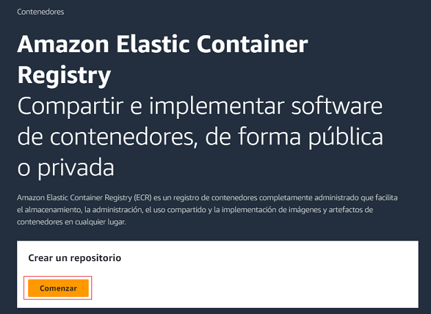

2. Crear Repositorio **PRIVADO**

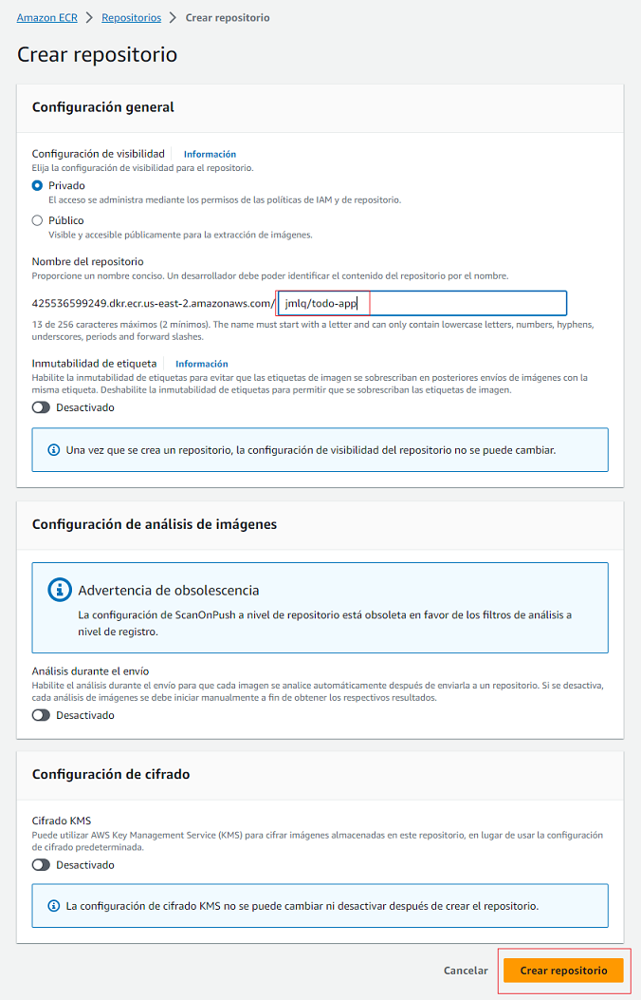

3. Ingresar al Repositorio

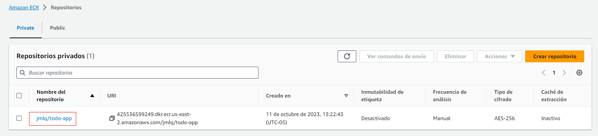

4. Ver comandos de Envío

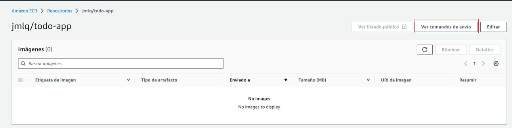

5. Seguir las siguientes instrucciones

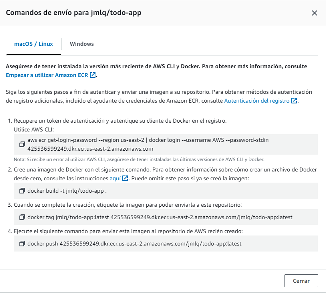

### **PUBLICAR IMAGEN DOCKER EN ECR PRIVADO**

1. Autentificación

```
        aws ecr get-login-password --region us-east-2 | docker login --username AWS --password-stdin 425536599249.dkr.ecr.us-east-2.amazonaws.com
```

2. Crear imagen en Docker

```
        docker build -t jmlq/todo-app .
```

3. Crear un tag en la imagen

```
        docker tag jmlq/todo-app:latest 425536599249.dkr.ecr.us-east-2.amazonaws.com/jmlq/todo-app:latest
```

4. Enviar imagen al repositorio ECR AWS

```
        docker push 425536599249.dkr.ecr.us-east-2.amazonaws.com/jmlq/todo-app:latest
```

### [CI/CD - AWS - EKS + Github Actions](https://github.com/eksctl-io/eksctl/blob/main/README.md#installation)

#### [**PERMISOS USUARIO**](https://eksctl.io/installation/)

| AWS Service      | Access Level                                       |
| ---------------- | -------------------------------------------------- |
| CloudFormation   | Full Access                                        |
| EC2              | Full: Tagging Limited: List, Read, Write           |
| EC2 Auto Scaling | Limited: List, Write                               |
| EKS              | Full Access                                        |
| IAM              | Limited: List, Read, Write, Permissions Management |
| Systems Manager  | Limited: List, Read                                |

> > Ver [Politica](./assets/politica-eks.json)

#### **CREAR VPC**

1. Crear VPC

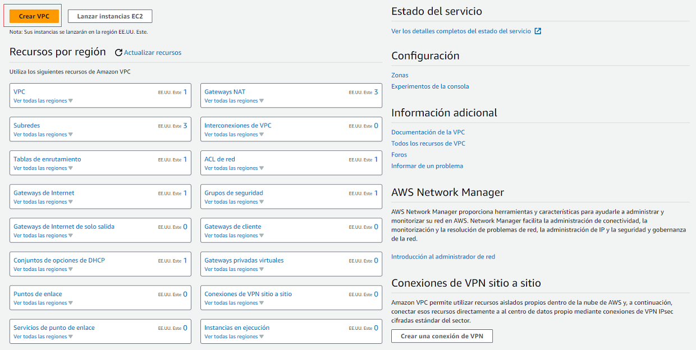

2. Configurar VPC: Numero de zonas 2, Cantidad de Subredes publicas 2, Cantidad de Subredes privadas 2

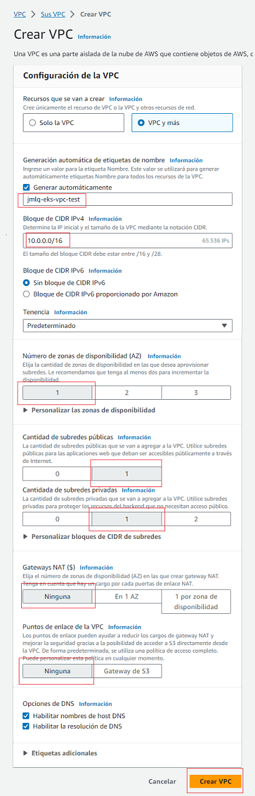

- Vista Previa
  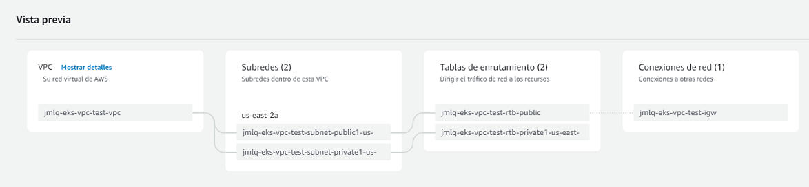

3. Flujo de trabajo

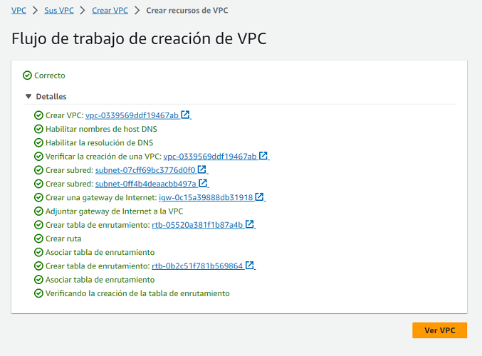

4. Ver VPC

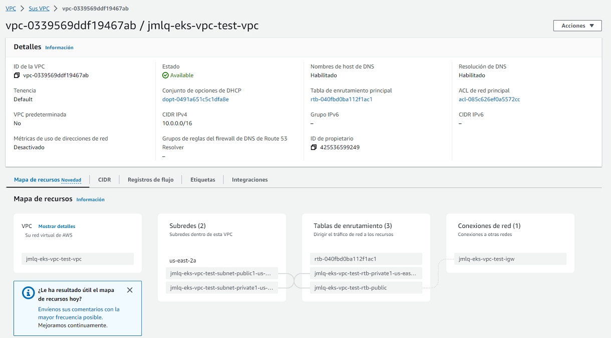

5. Editar Subnet


6. Habilitar IPv4 Publica

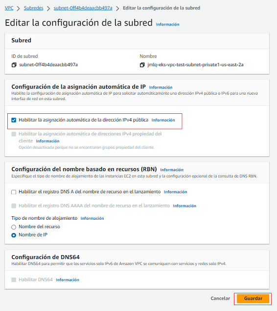

#### [**CREAR CLUSTER USANDO EKSCTL**](https://github.com/davejfranco/youtube-tutorial-src/blob/master/tutoriales/kubernetes/eksctl/TUTORIAL.md)

1.  Descargar [eksctl](https://github.com/eksctl-io/eksctl/blob/main/README.md#installation) es una herramienta de línea de comandos para crear y administrar clústeres de Kubernetes en Amazon EKS.

```
        eksctl version

        NOTA: tambien se puede ejecutar: choco install eksctl
```

2. Crear Archivo [Cluster](./cluster.yml)

3. Crear un Cluster EKS usando este comando:

```
        eksctl create cluster -f cluster.yml
```

4. Colocar un alias al Cluster

```
        aws eks update-kubeconfig --region us-east-2 --name name-cluster --alias nombre-alias
```

5. Obtener los nodos

```
        k get nodes
```

6. Eliminar Cluster EKS - Cuando ya no se usa

```
        eksctl delete cluster --name jmlq-eks-test
```

#### [**GITHUB ACTIONS**](https://docs.github.com/es/actions)

1. Archivo GitHub Actions [Github Actions](./.github/workflows/demo-github-actions.yml). Es un Workflow demo para saber como funciona `Github Actions`.

### TIPS GIT

```
        git status
        git add -A
        git commit -m "Mensaje"
        git push -u origin develop      //Push a otro branch que no existe
                                        //Se crea un pull request que se puede ejecutar
                                        //desde la consola o desde github

```

2. Archivo GitHub Actions [Github Actions](./.github/workflows/todo-actions.yml). Es un Workflow para cargar image `Docker` a `ECR` y a `EKS` con `Github Actions`.
